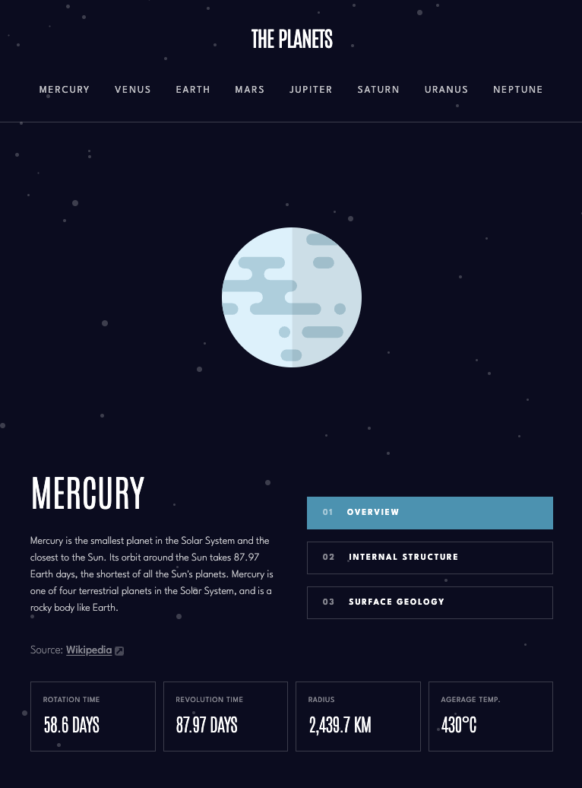
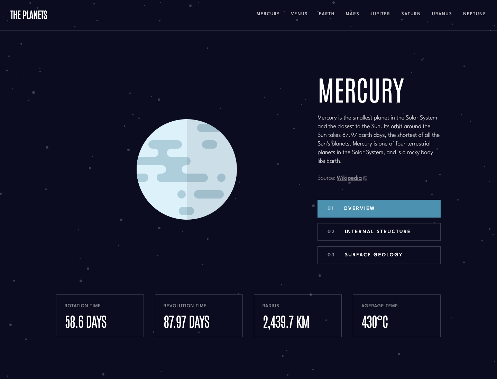

# Frontend Mentor - Planets fact site solution

This is a solution to the [Planets fact site challenge on Frontend Mentor](https://www.frontendmentor.io/challenges/planets-fact-site-gazqN8w_f). Frontend Mentor challenges help you improve your coding skills by building realistic projects.

## Table of contents

- [Frontend Mentor - Planets fact site solution](#frontend-mentor---planets-fact-site-solution)
  - [Table of contents](#table-of-contents)
  - [Overview](#overview)
    - [The challenge](#the-challenge)
    - [Screenshot](#screenshot)
    - [Links](#links)
  - [My process](#my-process)
    - [Built with](#built-with)
  - [Installation](#installation)
    - [Install dependencies](#install-dependencies)
    - [Run Application](#run-application)

## Overview

### The challenge

Users should be able to:

- View the optimal layout for the app depending on their device's screen size
- See hover states for all interactive elements on the page
- View each planet page and toggle between "Overview", "Internal Structure", and "Surface Geology"

### Screenshot

Mobile Screenshot


Tablet Screenshot



Desktop Screenshot



### Links

- Solution URL: [Repository](https://github.com/evertzner/planets-fact)
- Live Site URL: [Planet Facts](https://planet-facts-esteban-vertzner.netlify.app/)

## My process

### Built with

- Astro
- TailwindCSS

## Installation

### Install dependencies

```bash
pnpm install
```

### Run Application

```bash
pnpm run dev
```
